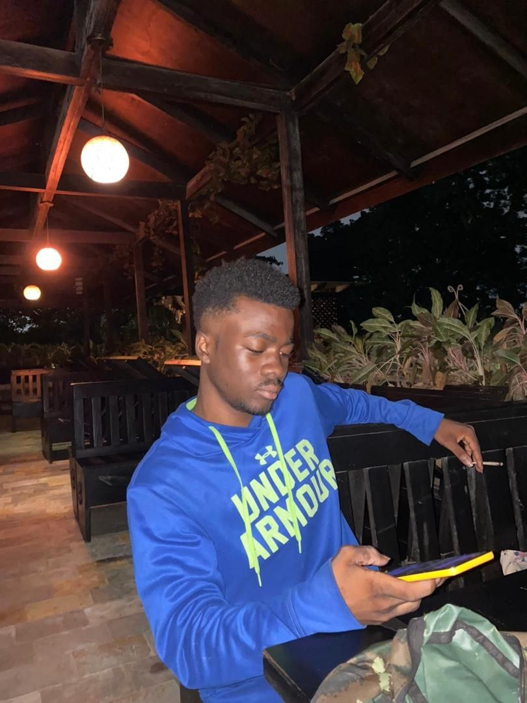
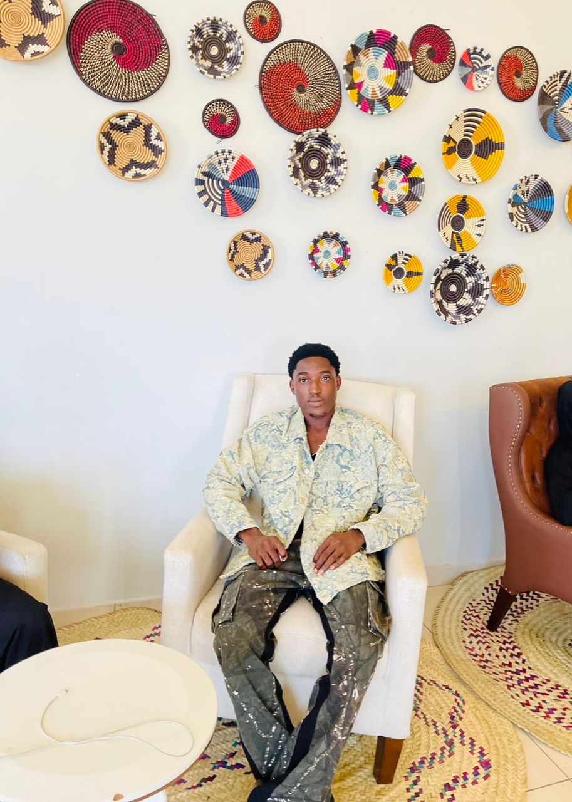
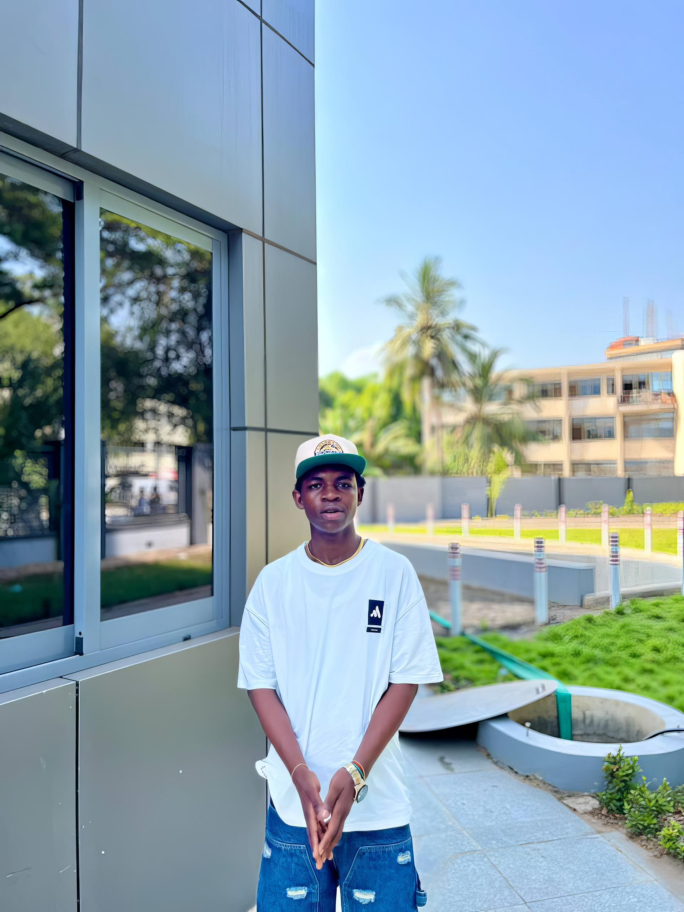

# Client Kim Website

Welcome to the GROUP 16 E-COMMERCE PROJECT repository! This project showcases our collaborative efforts to design and develop a modern and elegant websitee-commerce website selling luxury candles and bag. Dive in to explore the details of our work and get started with running the application.

---
The **NEW LUXURY VINTAGE CANDLES
** is designed to:
- Highlight premium candle products.
- Deliver a visually captivating and responsive design.
- Provide easy navigation and a memorable user experience.
- Incorporate reusable and efficient code.

## 📸 Team Members

# CLIENT-KIM WEBSITE

## 📸 Team Members

Here’s a group picture of our amazing team that worked together on this project:


---

### 👥 Meet the Team
TEAM PHOTOS ARE IN THE ASSETS FOLDER


1. **[Agyenim-Boateng Samuel Osei]**
Name: Agyenim-Boateng
   - Role: Frontend Developer
   - GitHub: [@samuel1578](https://github.com/samuel1578)
   - 

2. **[Member 2 Name]**
    Name: Kimberly Elikem Hiatsu 
   - Role: Backend Developer
   - GitHub: [@username2](https://github.com/username2)
   

3. 
    Name: Abdul Razak Abubakar 
   - Role: UI/UX Designer
   - GitHub: [@razak22084742](https://github.com/razak22084742)
   -

4. **[Member 4 Name]**
   - Role: Project Manager
   - GitHub: [@username4](https://github.com/username4)
   

5. **[Member 5 Name]**
-   Name: Melody Amppiah Ama Yorke
   - Role: Quality Assurance
   - GitHub: [@melodyyorke](https://github.com/melodyyorke)
   - 

6. **[Member 6 Name]**
   - Role: DevOps Engineer
   - GitHub: [@username6](https://github.com/username6)
   -

7. **[Member 7 Name]**
-   Name: Bestine Bronyah
   - Role: Content Creator
   - GitHub: [@bestinaa](https://github.com/bestinaa)
   -


8. **[Member 8 Name]**
-    Name: Opoku Kyeremateng Ransford
   - Role: Database Administrator
   - GitHub: [@ransford13](https://github.com/ransford13)
   - 
   

9. **[Member 9 Name]**
   - Role: Full-Stack Developer
   - GitHub: [@username9](https://github.com/username9)
   - Email: email9@example.com

10. **[Member 10 Name]**
    Name: Malba Reynolds
    - Role: Marketing Specialist
    - GitHub: [@rey202](https://github.com/rey202)
    - 

---

## 🚀 How to Run the Application

Follow these steps to set up and run the application:

1. **Clone the Repository**:
   ```bash
   git clone https://github.com/samuel1578/CLIENT-KIM-WEBSITE.git
   cd CLIENT-KIM-WEBSITE


_Our amazing team worked together to bring this project to life!
 
 STEP2
 Navigate to the Project Directory

bash
Copy code
cd CLIENT-KIM-WEBSITE
Open the Project

Open the index.html file located in the dist folder with your preferred web browser.
Alternatively, use a live server extension in Visual Studio Code for a seamless experience.
📸 Screenshots
1. Home Page

2. Blog Page

3. Shop Section

These pages demonstrate key features and a visually appealing design.

📜 Comprehensive Documentation
Overview
The Client Kim Website is designed to provide an immersive experience with:

A sleek and responsive layout.
Intuitive navigation.
Rich visuals and engaging content.
Technology Stack
HTML5
CSS3 (TailwindCSS)
JavaScript
Features
Dynamic Hero Sections: Highlight key offerings with stunning visuals.
Shop Section: Displays a curated selection of luxury products.
Blog Integration: Share articles and updates to engage with visitors.
Future Enhancements
Add an integrated shopping cart system.
Implement a backend with authentication and user profiles.
🤝 Contribution Guidelines
We welcome contributions! Follow these steps to contribute:

Fork the repository.
Create a new branch for your feature or bug fix.
Commit your changes with descriptive messages.
Submit a pull request for review.
📄 License
This project is licensed under the MIT License.

💡 Challenges Faced
Collaboration Across Multiple Team Members: Efficiently managing roles and code contributions using Git workflows.
Responsive Design: Ensuring seamless functionality across all screen sizes.
Optimization: Fine-tuning the performance of the web pages for faster load times.

💬 Feedback
Have suggestions or questions? Reach out to us via email.

🎉 Thank You for Visiting!
We appreciate your interest in our project. Feel free to star ⭐ the repository if you found it helpful!